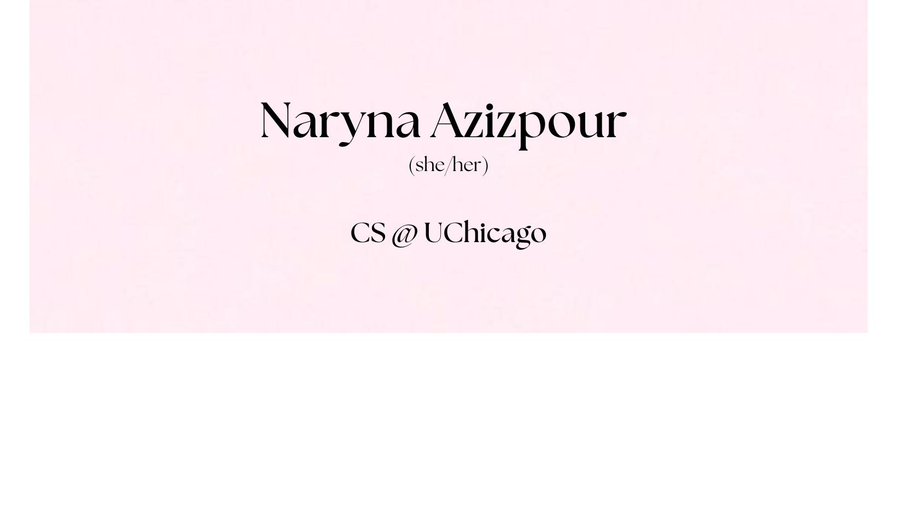

## Greetings, I'm Naryna Azizpour 👋

I'm a Computer Science student at the University of Chicago, passionate about finding creative solutions to real-world problems. My journey in the world of technology has exposed me to a diverse set of skills and tools.

**A glimpse into my toolkit:**

#### Programming Languages:

#### Web and App Development:

#### Tools and Environments:

#### Data and Analysis:

#### Device Provisioning:

### My Projects 🚀

You can find my personal projects in the dedicated projects repository:

📁 [personal-projects](https://github.com/cyl-art/cs50-ai)

Each project has short description in the `README` file and also comes with the `overview.txt` file with more information, so you can discover more about my work. Project demo is also available.

### How to reach me 📫

Here are some ways to connect with me:

📧 **Email:** [naryna2004@gmail.com](mailto:naryna2004@gmail.com) 
📱 **LinkedIn:** [Connect with me](https://www.linkedin.com/in/naryna-azizpour)

Feel free to reach out through any of these channels! Whether it's about projects, tech discussions, or just a friendly chat, I'm always here.

### 😄 Fun with Code: Programming Jokes and Chuckles 🤖

